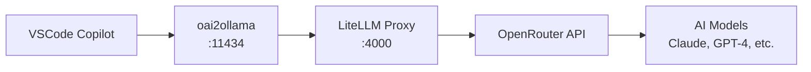

<div align="center">

# 🤖 Copilot-Ollama

**Use GitHub Copilot with OpenRouter models in VSCode Agent Mode**

[](https://opensource.org/licenses/MIT)
[](https://www.python.org/downloads/)
[](https://docs.astral.sh/uv/)

[Quick Start](#-quick-start) • [Configuration](#-configuration) • [How It Works](#-how-it-works) • [Contributing](#-contributing)

</div>

---

## 🎯 Problem

[OpenRouter](https://openrouter.ai) provides access to various AI models from OpenAI, Anthropic, and others. However, GitHub Copilot's Agent Mode requires models to support function calling/tools, but OpenRouter's API doesn't announce tool support for its models.

This prevents using powerful models like Claude, GPT-4, and others through OpenRouter with Copilot's advanced Agent Mode features.

## ✨ Solution

**copilot-ollama** creates a local proxy chain that:

- 🔄 Forwards requests to OpenRouter while preserving tool support
- 🛠️ Makes OpenRouter models compatible with Copilot's Ollama integration  
- 🚀 Enables Agent Mode with any OpenRouter model
- 🔧 Uses [LiteLLM](https://docs.litellm.ai/docs/simple_proxy) for OpenAI-compatible proxying
- 🔗 Uses [oai2ollama](https://github.com/CNSeniorious000/oai2ollama) for Ollama compatibility

## 🚀 Quick Start

### Prerequisites

- [uv](https://docs.astral.sh/uv/) package manager
- OpenRouter API key ([get one here](https://openrouter.ai/keys))
- VSCode with GitHub Copilot extension

### Installation & Setup

1. **Clone and navigate to the project**
   ```bash
   git clone https://github.com/bascodes/copilot-ollama.git
   cd copilot-ollama
   ```

2. **Set your OpenRouter API key**
   ```bash
   export OPENROUTER_API_KEY=your_openrouter_api_key_here
   ```

3. **Start the proxy servers**
   ```bash
   ./run.sh
   ```

4. **Configure VSCode**
   - Open VSCode settings
   - Set `github.copilot.chat.byok.ollamaEndpoint` to `http://localhost:11434`
   - Click "Manage Models" → Select "Ollama"

5. **Start coding!** 🎉
   Your OpenRouter models are now available in Copilot Agent Mode.

## ⚙️ Configuration

### Adding Models

Edit `config.yaml` to add or modify available models:

```yaml
# This section defines the models that your local proxy will advertise
model_list:
  - model_name: kimi-k2  # Name that appears in VSCode
    litellm_params:
      model: openrouter/moonshotai/kimi-k2  # Actual OpenRouter model

  - model_name: claude-3-sonnet
    litellm_params:
      model: openrouter/anthropic/claude-3-sonnet

  - model_name: gpt-4-turbo
    litellm_params:
      model: openrouter/openai/gpt-4-turbo
```

### Popular OpenRouter Models

Here are some recommended models to add:

| Model Name | OpenRouter Path | Description |
|------------|----------------|-------------|
| `claude-3-sonnet` | `openrouter/anthropic/claude-3-sonnet` | Excellent for code generation |
| `gpt-4-turbo` | `openrouter/openai/gpt-4-turbo` | Latest GPT-4 with improved performance |
| `mixtral-8x7b` | `openrouter/mistralai/mixtral-8x7b-instruct` | Fast and capable open-source model |
| `llama-3-70b` | `openrouter/meta-llama/llama-3-70b-instruct` | Meta's powerful open model |

## 🔧 How It Works



1. **VSCode Copilot** sends requests to what it thinks is an Ollama server
2. **oai2ollama** translates Ollama API calls to OpenAI format
3. **LiteLLM** proxies OpenAI-compatible requests to OpenRouter
4. **OpenRouter** routes to the actual AI model providers
5. Tool/function calling capabilities are preserved throughout the chain

## 🤝 Contributing

We welcome contributions! Here's how you can help:

- 🐛 **Report bugs** by opening an issue
- 💡 **Suggest features** or improvements
- 📖 **Improve documentation**
- 🔧 **Submit pull requests**

### Development Setup

```bash
# Clone the repo
git clone https://github.com/bascodes/copilot-ollama.git
cd copilot-ollama

# Install dependencies
uv sync

# Make your changes and test
export OPENROUTER_API_KEY=your_key
./run.sh
```

## 📝 License

This project is licensed under the MIT License - see the [LICENSE](LICENSE) file for details.

## 🙏 Acknowledgments

- [LiteLLM](https://docs.litellm.ai/) for the excellent proxy framework
- [oai2ollama](https://github.com/CNSeniorious000/oai2ollama) for Ollama compatibility
- [OpenRouter](https://openrouter.ai) for model access
- The VSCode and GitHub Copilot teams

---

<div align="center">

**⭐ Star this repo if it helped you unlock Copilot Agent Mode with your favorite models!**

</div>


